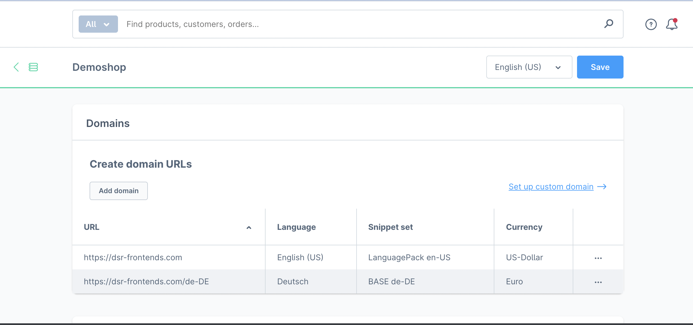

---
nav:
   title: App installation
   position: 20

---

# App Installation

::: warning
DSR application does not belong to *the default Storefront*. It's a standalone Frontend app running with Nuxt instance. This template will be hosted in a separate instance with a new domain (eg: `https://dsr-frontends.com`), which will be different from the Storefront domain.
This template is built based on the Shopware Frontends framework, so it inherits from Shopware Frontends concepts.
:::

## Setup sales channel for DSR
- Based on the business use case, the merchant can decide to add DSR to their existing sales channel or new sales channel.
- After specifying the sales channel, head to the *Domains section* and add the proper DSR domains with the proper languages. DSR can switch languages by the path, so please add the domains with the format below.
```
dsr-frontends.com - English
dsr-frontends.com/de-DE - Deutsch
```


The DSR domain (eg: `https://dsr-frontends.com`) should be selected as *Default appointment domain* in [Configuration Page - Appointments](./configuration.md#appointments)

## Init environment

- Install pnpm with global scope
```
npm install -g pnpm
```

- From the Shopware root folder `<shopware-root-dir>`, go to the folder of DSR templates.
```
cd ./custom/plugins/SwagDigitalSalesRooms/templates/dsr-frontends
```

- Generate env file
```
cp .env.template .env
```
**SHOPWARE_ENDPOINT**: This is the Shopware API Domain server.

**SHOPWARE_ACCESS_TOKEN**: This is the Shopware Access Token to connect to Shopware API. Head to sales channel you assign the DSR domain, find the `API access` section, and copy the `API access key`.

**ALLOW_ANONYMOUS_MERCURE**: This is the flag for development only. When the value = 1, it means your app is running with unsecured Mercure.

- Install dependencies
```
pnpm install
```

## CLI:
- For dev:
```
pnpm dev
```
Usually, port `3000` is the default port so that you can access the domain of the Frontend App `http://localhost:3000/`

- For build:
```
pnpm build
```
